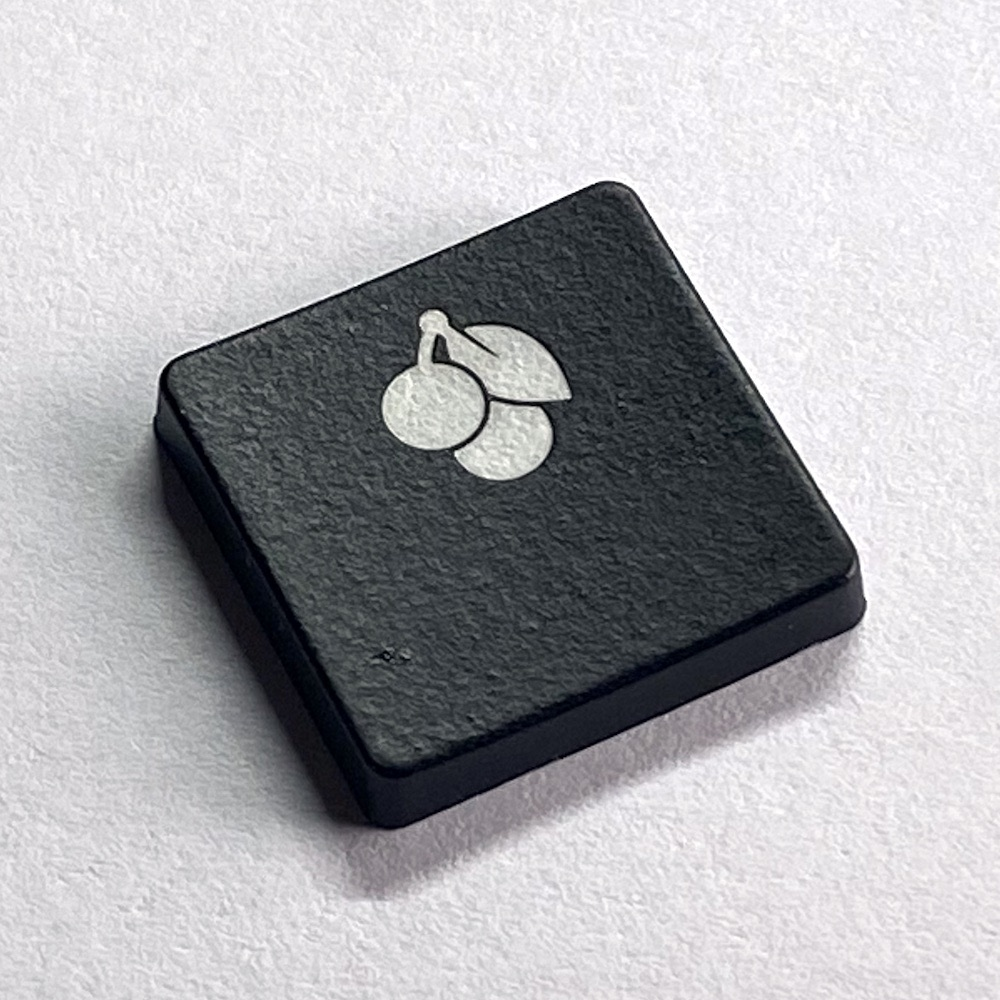
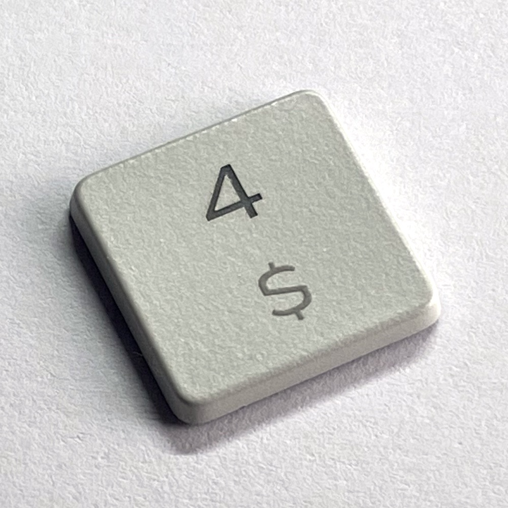
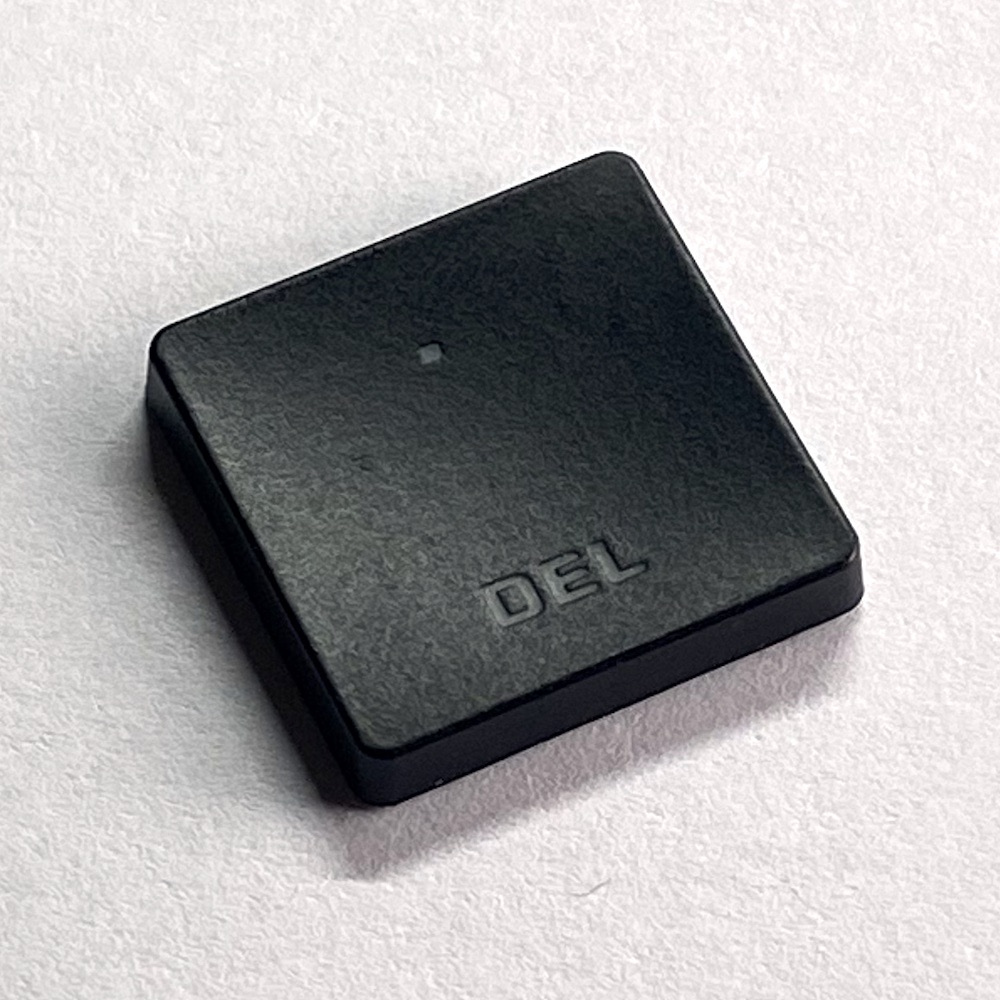
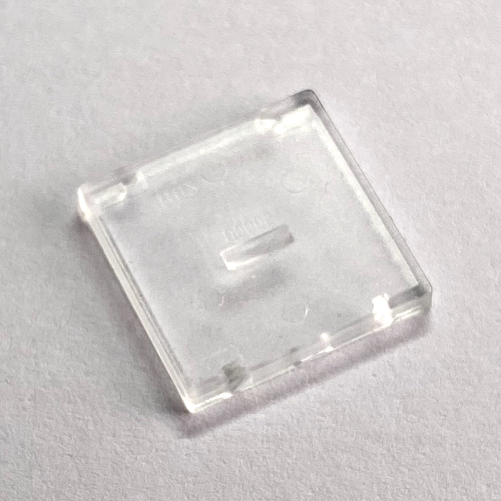
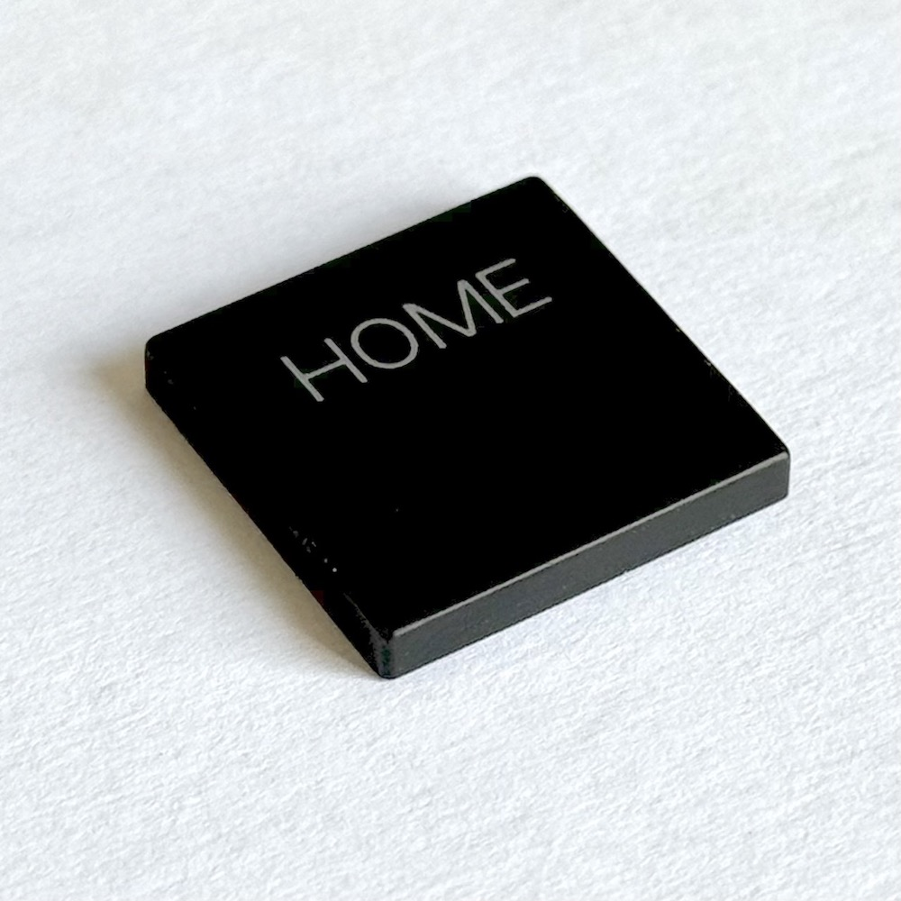

# Cherry MX ULP (Ultra Low Profile) Switches & Custom Keyboard Builds

This repository serves as an extensive resource for all things related to Cherry MX Ultra Low Profile (Cherry MX ULP) switches. It provides crucial information on custom keyboard builds using these switches, KiCad footprints for various switch configurations, datasheets, sources for keycaps, related projects, and purchase options.

## Contents

- [KiCad Footprints](#kicad-footprints--3d-model)
- [Datasheets](#datasheets)
- [Keycaps](#keycaps)
- [Projects Using ULP Switches](#projects-using-cherry-mx-ulp-switches)
- [Where to Buy ULP Switches](#where-to-buy-cherry-mx-ulp-switches)

## KiCad Footprints & 3D model

This repo contains KiCad footprints for:

- SMD Mounted Switches
- SMD Mounted Double-Sided
- Through-Hole Mounted (Hand Soldering)
- Through-Hole Mounted Double-Sided

**Please note that the double-sided mounts are still in the testing phase and might be subject to change.**

The repo also contains a 3D model of the switch [in a STEP format](https://github.com/pashutk/Cherry_MX_ULP/blob/main/Cherry_ULP.pretty/Cherry_MX_ULP.step). The model has limited dimensional precision and should only be used for visualization purposes.

## Datasheets

Although the datasheets we have currently are not highly detailed, they provide the essential specifications and information required for working with Cherry MX ULP switches. More comprehensive data will be added as they become available.

- [Cherry MX Ultra Low Profile Click](https://github.com/pashutk/Cherry_ULP/blob/main/CHERRY_MX_ULP_Click_Datasheet.pdf)
- [Cherry MX Ultra Low Profile Tactile](https://github.com/pashutk/Cherry_ULP/blob/main/CHERRY_MX_ULP_Tactile_Datasheet.pdf)

### Patents

For deeper understanding, it could be beneficial to look at related patents by Cherry. Although the following patent does not directly pertain to the exact model of the Cherry MX ULP switches, the general design principles are very similar:

- [Key module for a keyboard, and keyboard](https://patents.google.com/patent/US20230154700A1/en?inventor=Eduard+Ruff&sort=new)

These patents can serve as great resources for technical understanding and innovation around switch designs.

## Keycaps

### Where to source

Acquiring the right keycaps for Cherry MX ULP switches involves several potential sources:

1. **Off-the-shelf Keyboards**: Keycaps can be harvested from the following keyboards:
    - [Corsair K100 AIR WIRELESS RGB Ultra-Thin Mechanical Gaming Keyboard](https://www.corsair.com/ww/en/p/keyboards/ch-913a01u-ch/k100-air-wireless-rgb-ultra-thin-mechanical-gaming-keyboard-cherry-mx-ultra-low-profile-tactile-ch-913a01u-ch)
    - [Cherry KW X ULP](https://www.cherryamericas.com/kw-x-ulp)
    - [Mistel Air One](http://mistelkeyboard.com/products/9a36520f591f4f8b8e1253abf6885b51)
    - [KeyPulse Elite](https://www.kickstarter.com/projects/1658898886/keypulse-elite-slim-mechanical-keyboards/description)

2. **Dell Alienware Laptop Keyboard Module**: This module can also be used as a donor for keycaps. You can find it [here](https://www.aliexpress.com/item/1005005578673316.html?spm=a2g0o.order_detail.order_detail_item.2.2141f19c5ezQLC).

3. **3D Printing**: At this moment, 3D printing of custom keycaps for Cherry MX ULP switches requires additional, more detailed datasheets directly from Cherry. Despite this, there have been successful attempts at creating 3D printed keycaps:
    - [Mask Keyboard](https://www.reddit.com/r/ErgoMechKeyboards/comments/zpo9h6/mask200_4x6_split_keyboard_with_cherry_mxulp_keys/) by [marcoster](https://github.com/marcoster)
    - [Several keycap designs](https://www.thingiverse.com/thing:6058656) by [Alescito](https://www.thingiverse.com/alescito/designs)
    - [Cairn Mesa Keyboard](https://gitlab.cairn-devices.eu/cairntech/cairn-mesa-key) by [Cairn Devices](https://www.cairn-devices.eu/)

### Dimensions and photos

|          Name          |   WxHxD, mm    |       Profile       | HS, mm | HPS, mm | S, mm |                                                 Photo                                                 |
|------------------------|----------------|---------------------|--------|---------|-------|-------------------------------------------------------------------------------------------------------|
| Cherry KW x ULP        | 15.2x15.2x2.55 | Concave Cylindrical |   4.85 |    2.68 |   3.9 |         |
| Dell Module            | 15.9x15.9x1.72 | Flat                |    4.5 |    2.54 |     3 |                 |
| Corsair K100 Air       | 16x16x2.7      | Concave Spherical   |      5 |       3 |     3 |       |
| Cherry Early Prototype | 15x15x1.8      | Flat                |      4 |    2.12 |     - |  |
| Mistel Air One         | 16.1x16.2.25   | Flat                |    4.4 |     2.5 |   2.8 |                       |

- HS – height of a keycap with a switch
- HPS – height of a keycap with a pressed switch
- S – spacing, distance between keycaps

### Removing Keycaps Without Damage

To get a 1u keycap from a switch without causing too much damage, follow these steps:

- Gently pry off from the bottom left side and then the bottom right side using tweezers.
- To reduce the potential for damage, gently push the keycap from the opposite side using your fingertip.
- The keycap should be free from one side with a click sound, and then you can take it off the switch.

Non-1u keys are a bit trickier because they may use stabilizer bars and additional stabilizers, but the principle stays the same.

## Projects Using Cherry MX ULP Switches

For inspiration or technical insight, check out these projects that incorporate Cherry MX ULP switches in their keyboard builds, created by some innovative members of the community:

### Keyboard Builds
1. [Mask Keyboard](https://www.reddit.com/r/ErgoMechKeyboards/comments/zpo9h6/mask200_4x6_split_keyboard_with_cherry_mxulp_keys/) by [marcoster](https://github.com/marcoster)
2. [Cairn Mesa Keyboard](https://gitlab.cairn-devices.eu/cairntech/cairn-mesa-key) by the team at [Cairn Devices](https://www.cairn-devices.eu/)
3. [ULPpad](https://t.me/s/pashutkkb/60) by [pashutk](https://github.com/pashutk)
4. [ULP-Dactyl](https://github.com/jonboh/ulp-dactyl) by [jonboh](https://github.com/jonboh)
5. [mnhTTn](https://github.com/fooker/mnhttn) by [fooker](https://github.com/fooker)
6. [btrfld_ulp](https://github.com/SolidHal/btrfld) by [SolidHal](https://github.com/SolidHal)

### Custom Components and Techniques
1. Interesting take on [handwiring using point pins](https://www.reddit.com/r/ErgoMechKeyboards/comments/18qr1xp/cherry_ulp_prototyping/) by [Magnus Ascathon](https://www.reddit.com/user/Magnus_Ascathon/)
2. Single key PCBs [Amoeba Cherry ULP](https://github.com/jonboh/amoeba-cherry-ulp) by [jonboh](https://github.com/jonboh)

This list is not exhaustive, and we welcome contributions from the community. If you know of or have developed a project using Cherry MX ULP switches that is not listed here, please refer to the [Contribution](#contribution) section for information on how to share your work with the community.

## Where to Buy Cherry MX ULP Switches

If you're ready to start your own project, below are links to stores where you can purchase Cherry MX ULP switches:

1. [Reichelt Elektronik](https://www.reichelt.de/de/en/cherry-mx-ultra-low-profile-rgb-pushbutton-module-cherry-mx6c-k3nb-p335040.html) - Germany, EU
2. [Taobao](https://detail.1688.com/offer/681367194838.html) - Shenzhen, China

Remember, availability can vary based on your location and the store's stock levels.

## Contribution

We're always looking for more information about Cherry MX ULP switches. If you have information to share or would like to contribute to the development of the KiCad footprints, please open an issue or submit a pull request.

## License

This project is licensed under the MIT License. This means you're free to use, copy, modify, merge, publish, distribute, sublicense, and/or sell copies of any materials in this project. However, you must provide appropriate attribution to the original author.

For more details, please refer to the [LICENSE](LICENSE) file in this repository.

## Disclaimer

This is an independent project and has not been authorized, sponsored, or otherwise approved by Cherry or any other parties. We do not take any responsibility for any damages or legal issues that may arise from using the information provided in this repository. Use it at your own risk.

---

Remember, this is a living document. Check back often for updates and new information. We're excited to see what you build with Cherry MX ULP switches!
